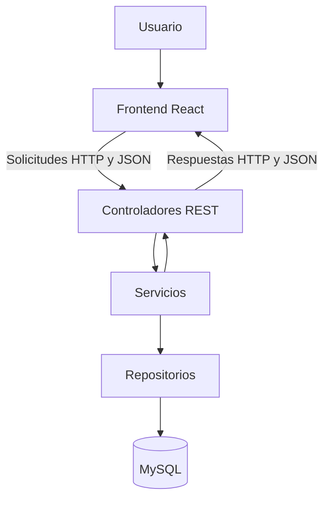

# Arquitectura del proyecto

## Arquitectura general

El sistema utilizará una arquitectura cliente-servidor. El frontend funcionará como cliente web y se comunicará con el backend mediante una API REST. El backend procesará las reglas de negocio y accederá a la base de datos MySQL.



## Frontend

El frontend se desarrollará como una aplicación web utilizando:

- React.
- TypeScript.
- Vite.
- Bootstrap.
- HTML y CSS.

Será responsable de:

- Mostrar formularios, listados y mensajes.
- Validar datos básicos antes de enviarlos.
- Consumir los endpoints de la API REST.
- Administrar la navegación entre las distintas pantallas.
- Mostrar los errores y resultados informados por el backend.

React permitirá organizar la interfaz mediante componentes reutilizables. TypeScript aportará tipado estático y facilitará la detección anticipada de errores.

## Backend

El backend se desarrollará con:

- Java 21.
- Spring Boot.
- Spring Web.
- Spring Data JPA.
- Bean Validation.
- Spring Security.

Se utilizará una arquitectura organizada en capas:

### Controller

Recibirá las solicitudes HTTP, validará los datos de entrada y devolverá las respuestas correspondientes.

### Service

Contendrá las reglas de negocio y coordinará las operaciones necesarias para cada caso de uso.

### Repository

Se encargará del acceso a la base de datos mediante Spring Data JPA.

### Model

Representará las entidades principales del dominio y su relación con las tablas de la base de datos.

### DTO

Permitirá transferir los datos entre el frontend y el backend sin exponer directamente las entidades de persistencia.

Esta separación facilita el mantenimiento, las pruebas y la evolución independiente de cada parte del sistema.

## Base de datos

Se utilizará MySQL como sistema gestor de base de datos relacional.

La elección se debe a que:

- Los datos presentan relaciones claramente definidas.
- Se necesita integridad referencial.
- Se requieren claves primarias y foráneas.
- Se deben evitar registros duplicados.
- Se necesitan consultas por pacientes, profesionales, fechas y estados.
- Es compatible con Spring Data JPA e Hibernate.

El esquema principal se encuentra en `database/schema.sql` y los datos de ejemplo en `database/datos_pruebas.sql`.

## Comunicación

El frontend y el backend se comunicarán mediante HTTP utilizando una API REST. Los datos se enviarán y recibirán en formato JSON.

Las operaciones principales utilizarán los métodos:

- `GET` para consultas.
- `POST` para registros.
- `PUT` o `PATCH` para modificaciones.
- Las bajas se implementarán de manera lógica, modificando el estado activo del registro.

## Seguridad

La arquitectura contempla:

- Autenticación de usuarios.
- Contraseñas almacenadas mediante BCrypt.
- Tokens JWT para las sesiones.
- Autorización según roles.
- Protección de endpoints.
- Configuración de CORS para la comunicación entre frontend y backend.

Los roles previstos son:

- Administrador.
- Recepcionista.
- Profesional.

La implementación completa de autenticación y autorización se realizará en una etapa posterior de codificación.

## Organización del repositorio

```text
/
├── backend/
├── database/
├── docs/
├── frontend/
└── README.md
```

- `backend`: estructura correspondiente a la API y la lógica del sistema.
- `frontend`: estructura correspondiente a la interfaz web.
- `database`: scripts y archivos relacionados con la base de datos.
- `docs`: diagramas y documentación de análisis y diseño.
- `README.md`: presentación general e instrucciones del proyecto.

## Justificación de la arquitectura

La arquitectura cliente-servidor con backend en capas fue elegida porque permite separar la interfaz, la lógica de negocio y el acceso a los datos. Esta separación facilita el trabajo del equipo, reduce el acoplamiento y permite probar cada módulo de manera independiente.

La API REST permitirá que el frontend se comunique con el backend sin depender de su implementación interna. MySQL garantizará la integridad de las relaciones entre pacientes, profesionales, especialidades, horarios y turnos.