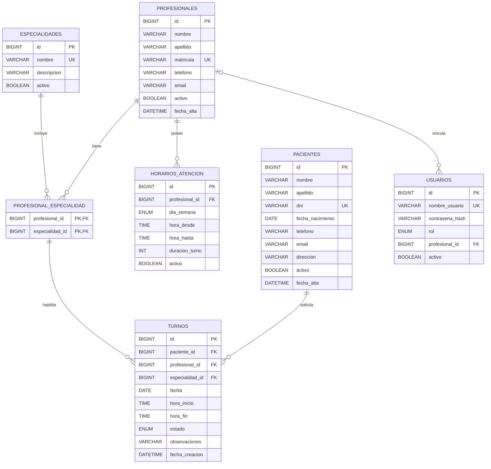

# Diagrama entidad-relación

El siguiente diagrama representa las entidades principales del Sistema de Gestión de Turnos para una Clínica Médica. Incluye las claves primarias, claves foráneas y relaciones definidas en `database/schema.sql`.

## Relaciones principales

- Un paciente puede tener varios turnos.
- Un profesional puede tener varios horarios de atención.
- Un profesional puede tener una o más especialidades.
- Una especialidad puede estar asociada con varios profesionales.
- La relación entre profesionales y especialidades se representa mediante la tabla `profesional_especialidad`.
- Cada turno corresponde a un paciente, un profesional y una especialidad habilitada para ese profesional.
- Un usuario con rol profesional puede estar vinculado con un registro de la tabla `profesionales`.

## Claves y restricciones principales

- `pacientes.dni` es único.
- `profesionales.matricula` es única.
- `especialidades.nombre` es único.
- La combinación de `profesional_id` y `especialidad_id` constituye la clave primaria de `profesional_especialidad`.
- No se permiten dos turnos con el mismo profesional, fecha y hora de inicio.
- La hora de finalización de un turno debe ser posterior a su hora de inicio.
- La hora final de un horario de atención debe ser posterior a su hora inicial.
- La duración asignada a los turnos debe ser mayor que cero.

## Índices principales

- `idx_turnos_paciente`: facilita las consultas de turnos por paciente.
- `idx_turnos_profesional_fecha`: facilita las consultas por profesional y fecha.
- `idx_turnos_estado`: facilita el filtrado por estado.
- `idx_horarios_profesional`: facilita la consulta de horarios por profesional.
- `idx_pacientes_apellido`: facilita la búsqueda de pacientes por apellido.
- `idx_profesionales_apellido`: facilita la búsqueda de profesionales por apellido.